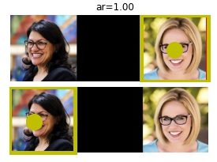

# Twitter Ethics Challenge: Pixel Perfect
Submission to Twitter's algorithmic bias bounty challenge, by Travis Hoppe ([@metasemantic](https://twitter.com/metasemantic?lang=en)).



## Abstract

We build off the work presented by [Yee et al.](https://arxiv.org/abs/2105.08667) and show that a trivial image modification can dramatically change the saliency ranking of two images. This modification can result in different crops for the same images. Specifically, we find that adding padding to the left of an image can alter the selection of which image to crop. At least 16% of all image pairs are exploitable in this way, possibly much larger. The exploit, which can be easily triggered intentionally, happens naturally and is 22% more likely to occur when comparing white women to women of color or other ethnicities.

## Example

The following images are almost identical, with one small exception. The second image has a 13 pixel padding on the left. This is enough to change which image is cropped!

**Rashida Tlaib is cropped**


**Kyrsten Sinema is cropped**


To replicate this, you can use the code provided or the [jupyter notebook](https://github.com/twitter-research/image-crop-analysis/blob/main/notebooks/Image%20Annotation%20Dash.ipynb).

## Methods

To ensure a dataset that is 1] representative of gender and ethnicity, 2] publicly available, 3] uniform in framing and pose, and 4] consensual, we use images from the 117th US Congress. Images and demographic data provided by Civil Service USA and can be found at the following locations:

+ https://github.com/CivilServiceUSA/us-house
+ https://github.com/CivilServiceUSA/us-senate
+ Additional information for the [117th US Congress](https://www.congress.gov/members?q=%7B%22congress%22%3A%5B%22117%22%5D%7D&pageSize=250&page=1)

Each congressional representative and senator was put in competition with each other. Similar to the [Twitter paper](https://arxiv.org/abs/2105.08667), we placed a black buffer between the images and asked the cropping algorithm for the most salient point using the aspect ratio of the original images (1:1).

The cropping algorithm computes a set of saliency points across 140 evenly spaced points along the composite image (1536x512). In this case it works out to about 40 pixels per point. We evaluate the "winner" for the original composite image, then examine if the winner changes when we add a buffer of fixed size to the left of the image. We used buffers of size `[0, 6, 13, 19, 26, 31]`. A pair of images is considered "exploitable" if there exists a buffer of some size where we can change which image is cropped.

Anecdotally, we found a much larger effect when we applied the attack to buffers of _all_ sizes, but computational constraints prevented this full analysis. We also could increase the attack surface by inserting the buffer between the images (but this modified one image independently of the other).  Since the buffer shifted both images by the same amount, it is considered "fair" for attacks of all images in the wild.

For demographics, we split the population into the two categories of gender provided (all members identified as either male or female), and two categories of ethnicity: white and other. "Other", or not-white, was chosen as a category for statistical power as the various subgroups (African American, Hispanics, pacific islanders, ...), were not large enough to draw meaningful conclusions. Future work should examine this bias using more nuanced subgroups with larger datasets.

## Results

We found that out of the (536^2) image pairs considered, **16.4% of them were exploitable by our method**. Furthermore, we found that the attack was **disproportionately more likely to occur when comparing non-white women to white women**. We found **an increase of about 22.2%** from the baseline (20.04% up from 16.4%) when considering this subgroup (p<<0.001).

Full tables of statistics are provided at the end of the README. Self-pairs were not considered, so the actual number of considerations was 536^2 - 536. Additionally, we find slight differences considering image A-B vs B-A, so we considered them as separate cases but they were not statistically significant.

## Self-score

+ **Type of Harm** (20 base points)

Unintentional underrepresentation.

+ **Damage or impact** ((1.4 + 1.2)/2 = 1.3)

We show that along multiple axis of identity (gender and ethnicity) this exploit and not that it is magnified for women of color (x1.4). Being cropped out of an image, or having high variability of being cropped out of an image (UI gaslighting) can have a moderate impact to a person's well-being (x1.2)

+ **Affected users** (1.2)

We estimate that the number of users that have been seen or exposed to images of multiple people, where one of them is a woman of color is at least one million (x1.2). With 187 million active user each posting or reposting a single target image once a year with 10 views, this is still gives 5 million views per user per day.

+ **Likelihood only graded for unintentional harms** (1.3)
+ **Exploitability only graded for intentional harms:** (not scored)

While this is not an intentional harm, it can be! Code provided can easily duplicate this effect (x1.3 if scored). The author notes that this algorithm isn't exactly the same as the one live on Twitter now (8/2/21) as it currently chooses to do nothing, and instead pick the black square in the middle ([Roll Safe meme](https://knowyourmeme.com/memes/roll-safe): can't have bias if we remove the humans).

We note that it is difficult to tell harm has occurred in-the-wild, as the effect may be unnoticed as the user isn't presented with the alternative. That said, we show that it works on real world images as well in the examples below. Considering that images with multiple people are shown on Twitter daily, this exploit is very likely (1.3).

Here the most salient point is marked by a green dot. The images are only offset by a single width pixel. 


This this example, over the span of three pixels there are three different cropping points:


+ **Justification:** (1.0)

We hope that the reader can see that the current cropping algorithm is brittle and easily exploited. This effect happens naturally with different images and is dependent on unimportant information at the edge of the image. The harm here is subtle, but it is important to note that it isn't uniform across all demographics. If some users are arbitrarily and inconsistently cropped, this creates an experience that their presence (and self!) in a photo is also arbitrary. We score this section at (x1.00) as the methodology is sound but could use a larger dataset and the effect isn't as harmful as a racially biased crop that was shown in the first paper. 

+ **Clarity of contribution:** (1.5)

This submission is fully documented with workable examples, a reproducible dataset, and evidence of harm both intentional and unintentionally (x1.5). We note that the exploit can be fixed in numerous way at the cost of more computational resources. Instead of a single point, multiple points can be evaluated heuristically (as the original authors suggest). Also, kernel densities can be estimated to provide a smoother representation of the most salient _area_ vs a single point.

+ **Final Score:** (60.84)

`20 x (1.3 + 1.2 + 1.3 + 1.0 + 1.5) = 60.84`

## Appendix and data tables


We first report results reflected in Yee et. all: gender plays a strong role (towards females), while the role of ethnicity matters, but in a more subtle way. p-values are constructed from a two-sided binomial test using the sample mean as the expected value, significance (when shown), is set at p<0.01 and provided for visual convenience.

```
            key        n       k       pct         pvalue
0    white_male  2095416  909151  0.433876   0.000000e+00
1    other_male   429336  224617  0.523173  1.305973e-202
2  white_female   602352  382057  0.634275   0.000000e+00
3  other_female   301176  198315  0.658469   0.000000e+00
```

Reflecting the gender and ethnicity parity in the party structure we see the same result:

```
           key        n       k       pct  pvalue
0  independent    12816    3807  0.297051     0.0
1   republican  1672488  764219  0.456935     0.0
2     democrat  1742976  946114  0.542815     0.0
```

Considering the interaction between gender and ethnicity, the largest difference is between white males and females. For non-white males the bias still exists, but is less. n reflects not only each pairwise comparisons but at all levels of offset.

```
        left_key     right_key       n       k       pct         pvalue    sig
0     white_male  other_female   92214   25963  0.281552   0.000000e+00   True
1     white_male  white_female  184428   56958  0.308836   0.000000e+00   True
2     other_male  other_female   18894    7092  0.375357  2.401844e-287   True
3     other_male  white_female   37788   15129  0.400365   0.000000e+00   True
4     white_male    other_male  131454   54628  0.415567   0.000000e+00   True
5   white_female  other_female   26508   13085  0.493625   2.722065e-05   True
6     other_male    other_male   26532   13336  0.502638   2.081554e-01  False
7     white_male    white_male  639612  322983  0.504967   1.319497e-02  False
8   other_female  other_female   12972    6627  0.510870   3.253872e-01  False
9   white_female  white_female   52452   26799  0.510924   4.365079e-02  False
10  other_female  white_female   26508   14083  0.531274   7.589998e-16   True
11    other_male    white_male  131454   77808  0.591903   0.000000e+00   True
12  white_female    other_male   37788   23337  0.617577   0.000000e+00   True
13  other_female    other_male   18894   12115  0.641209  1.623488e-304   True
14  white_female    white_male  184428  130629  0.708293   0.000000e+00   True
15  other_female    white_male   92214   67669  0.733826   0.000000e+00   True
```

Next we consider the effects of apply the exploit. The raw breakdown along demographics show that there is a difference with non-white females and white female from this expected 15%. Here, n reflects only the pairwise comparisons:

```
            key       n      k       pct        pvalue    sig
0  white_female  100392  15912  0.158499  7.780860e-07   True
1    other_male   71556  11551  0.161426  4.103492e-02  False
2    white_male  349236  57507  0.164665  5.122208e-01  False
3  other_female   50196   8882  0.176946  3.039690e-14   True
```

Finally, we show the main results using both subgroups of ethnicity and gender.

```
        left_key     right_key       n      k       pct        pvalue    sig
0   white_female    white_male   30738   4503  0.146496  1.549290e-17   True
1     white_male  white_female   30738   4608  0.149912  6.904292e-12   True
2     other_male    other_male    4422    677  0.153098  4.668935e-02  False
3     other_male  white_female    6298    981  0.155764  6.884341e-02  False
4     other_male    white_male   21909   3538  0.161486  2.739183e-01  False
5     white_male    other_male   21909   3545  0.161806  3.338248e-01  False
6   white_female    other_male    6298   1021  0.162115  6.584081e-01  False
7   other_female    white_male   15369   2528  0.164487  9.392602e-01  False
8     white_male  other_female   15369   2571  0.167285  3.113621e-01  False
9     white_male    white_male  106602  18107  0.169856  8.897830e-07   True
10  white_female  white_female    8742   1506  0.172272  4.481319e-02  False
11  other_female    other_male    3149    555  0.176246  7.125701e-02  False
12    other_male  other_female    3149    557  0.176882  5.743075e-02  False
13  other_female  white_female    4418    885  0.200317  2.955497e-10   True
14  white_female  other_female    4418    902  0.204165  3.565989e-12   True
15  other_female  other_female    2162    442  0.204440  9.085229e-07   True
```

Useful links for the submission:
+ [Challenge blog post](https://blog.twitter.com/engineering/en_us/topics/insights/2021/algorithmic-bias-bounty-challenge)
+ [Hacker One entry point](https://hackerone.com/twitter-algorithmic-bias?type=team)
+ [Crop code on github](https://github.com/twitter-research/image-crop-analysis)
+ [arXiv paper](https://arxiv.org/abs/2105.08667)